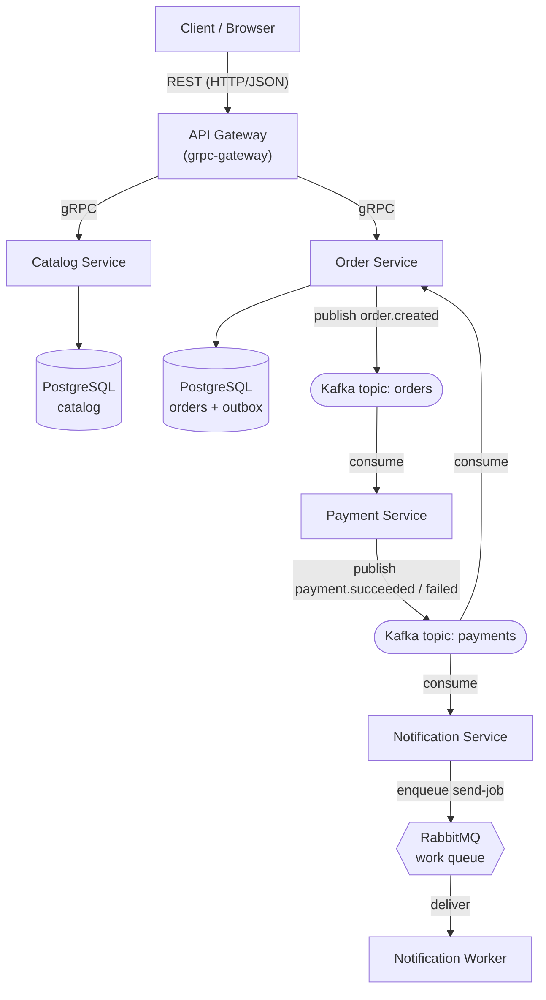
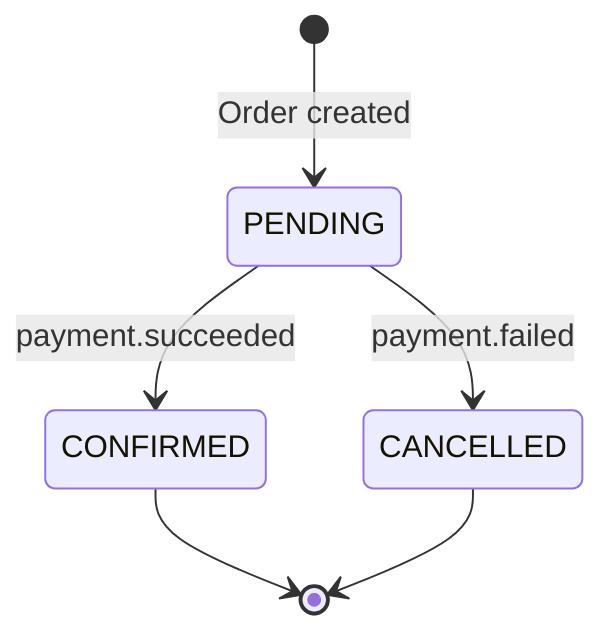
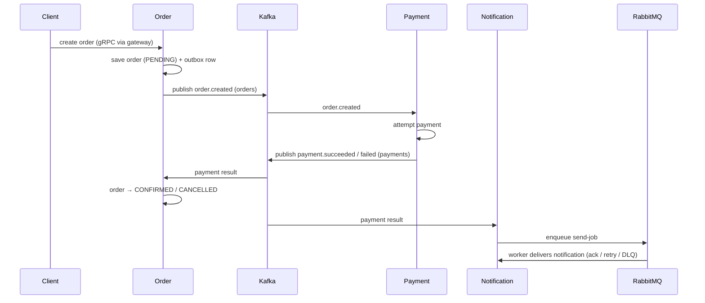

## What we're building

Before we write a line of code, let's map the whole system on one page. ShopMicro has five services and two kinds of communication between them: a **synchronous path** where the gateway calls a service and waits for an answer (gRPC), and an **asynchronous path** where a service publishes an event and moves on, letting other services react in their own time (Kafka and RabbitMQ).

Here's the shape of it:

The **solid gRPC arrows** at the top are the synchronous path: a request comes in as REST, the gateway turns it into a gRPC call, a service answers, and the gateway turns the answer back into JSON. The **Kafka and RabbitMQ arrows** below are the asynchronous path: no one waits on a reply — services drop events onto a log or a queue and other services pick them up.

## Why

Splitting the system this way lets each part use the tool it's best suited to. gRPC gives fast, typed request/response between the gateway and the services that must answer *now* (show me this product, create this order). Kafka gives a durable, **replayable event log** for the order lifecycle, so Payment and Order can react to `order.created` and `payment.*` without being tightly wired together. RabbitMQ gives a **work queue** for the side effect of actually sending a notification, with acknowledgements and retries so a transient email failure doesn't lose the message.

### The synchronous path (gRPC)

This is the classic request/response — read the catalog, place an order:

1. The **client** sends an HTTP/JSON request to the **API Gateway**.
2. The gateway (grpc-gateway) translates it into a **gRPC** call and forwards it to the right service — **Catalog** for products, **Order** for orders.
3. The service runs its logic, reads or writes its **own PostgreSQL**, and returns a typed gRPC response.
4. The gateway translates the response back to JSON and answers the client.

Crucially, each service owns its own database. Catalog can't reach into Order's tables — it has to ask over gRPC. That isolation is what makes them independently deployable.

### The asynchronous path (Kafka + RabbitMQ)

This is what turns "create an order" into a coordinated, multi-service flow:

1. When Order creates an order, it publishes an **`order.created`** event to the Kafka **`orders`** topic — reliably, using the outbox pattern (more below).
2. **Payment** consumes `order.created`, attempts the charge, and publishes **`payment.succeeded`** or **`payment.failed`** to the Kafka **`payments`** topic.
3. **Order** consumes the `payments` topic and moves the order to `CONFIRMED` or `CANCELLED`.
4. **Notification** *also* consumes the `payments` topic and, rather than sending an email inline, **enqueues a send-job** onto a **RabbitMQ** work queue.
5. A **worker** pulls the job off the queue, delivers the notification, and **acks** it. If delivery fails it's retried; after too many failures it lands in a **dead-letter queue** for inspection.

Why two brokers? Kafka is an **event log** — events are retained and can be **replayed**, and multiple services (Order *and* Notification) can independently read the same `payments` stream. RabbitMQ is a **work queue** — each send-job should be handled by exactly one worker, with per-message acks and retries. Using each for what it's designed for is the lesson.

### The order saga

Because the flow spans Order, Payment, and back to Order, we can't wrap it in one database transaction — the services don't share a database. Instead we coordinate it as a **saga**: a sequence of local transactions, each triggered by an event, that together drive the order from `PENDING` to a final state.

Here's the same flow over time, showing who publishes and consumes what:

To publish `order.created` **reliably**, Order uses the **outbox pattern**: in the *same* database transaction that saves the order, it writes an "outbox" row describing the event. A separate publisher reads unsent outbox rows and pushes them to Kafka, marking them sent. This guarantees the event is published **if and only if** the order was saved — no lost events, no phantom events. And because a consumer might see the same event twice (Kafka is at-least-once), every consumer is **idempotent**: processing the same `order.created` or `payment.succeeded` twice has the same effect as processing it once.

## Why this architecture

ShopMicro's design is a set of deliberate trade-offs. Here's an honest look at each major choice.

### Microservices (vs a monolith)

- **Pros:** Each service is small, owns its own data, and can be deployed, scaled, and even rewritten independently; a team can own one service end to end; a crash in Payment doesn't take down Catalog.
- **Cons:** You trade in-process function calls for network calls that can fail, add latency, and need serialization; there's no single database transaction across services; operating five services + two brokers is far more moving parts than one binary.
- **Why we chose it:** The whole point of this project is to *feel* those trade-offs. For a real small store a monolith would likely be simpler — but you'd never learn gRPC, event streaming, or the saga, which is exactly what ShopMicro is here to teach.

### gRPC (vs REST between services)

- **Pros:** A **typed contract** (protobuf) shared by both sides catches mismatches at build time; compact binary framing over HTTP/2 is fast; code generation gives you client and server stubs for free; streaming is first-class.
- **Cons:** Not human-readable on the wire like JSON; browsers can't call it directly (hence the gateway); you need the `.proto` toolchain (buf) and generated code in your build.
- **Why we chose it:** Between services, a typed, fast, generated contract beats hand-written REST clients. We still expose REST to the outside world via grpc-gateway, so we get both.

### Kafka vs RabbitMQ — when each

These aren't competitors here; they do different jobs, and knowing which to reach for is a core skill.

- **Kafka — event log.** Use it when events are **facts about what happened** that may have **many independent readers** and may need to be **replayed**. The `payments` stream is read by both Order and Notification; a new service could be added later and read the whole history. Kafka retains events and lets each consumer track its own position.
- **RabbitMQ — work queue.** Use it when a message is a **job to be done once** by **one** worker, with acknowledgements, retries, and a dead-letter queue. Sending a notification is exactly that: enqueue it, one worker delivers it, ack on success, retry or dead-letter on failure.
- **The trade-off:** Kafka shines at fan-out and replay but you manage consumer offsets and partitions; RabbitMQ shines at per-message work semantics but isn't a durable, replayable log. Picking the wrong one (a work queue for an event log, or vice versa) is a classic mistake — ShopMicro shows both, side by side.

### The saga + outbox (vs distributed transactions)

- **Pros:** No distributed lock or two-phase commit across services; each step is a simple local transaction plus an event; the outbox guarantees "saved and published" are atomic; idempotent consumers make at-least-once delivery safe.
- **Cons:** More moving parts than a single `BEGIN…COMMIT`; the system is **eventually consistent**, so an order is briefly `PENDING` before it's `CONFIRMED`; compensating logic (cancelling on failure) is your responsibility, not the database's.
- **Why we chose it:** A true distributed transaction (2PC) across independent services is fragile and rarely used in practice. The saga is how real event-driven systems keep multiple services consistent, and the outbox is the standard trick for publishing reliably.

### Kubernetes + Helm (vs Docker Compose)

- **Pros:** Kubernetes gives you self-healing, rolling deploys, scaling, and service discovery for a multi-service system; a **Helm chart** packages all five services + infrastructure into one versioned, parameterized install.
- **Cons:** Much steeper learning curve and more operational overhead than Compose; overkill for a single machine.
- **Why we chose it:** Compose is perfect for local development (and we use it for exactly that in Module 13). But a microservices system is *meant* to run on an orchestrator — so Module 14 packages ShopMicro as a Helm chart to show how it deploys for real.

## Verify

Check your understanding:

- Can you trace an order from the client's REST request all the way to a `CONFIRMED` state and a delivered notification, naming every gRPC call and every event?
- Why can't the order flow be a single database transaction, and what replaces it?
- When would you reach for Kafka, and when for RabbitMQ? Give the reason for each in ShopMicro.
- What does the outbox pattern guarantee, and why do consumers still need to be idempotent?

## Recap

ShopMicro is five Go services wired along two paths. The **synchronous path** is gRPC: the API Gateway translates REST into typed gRPC calls to Catalog and Order, each owning its own PostgreSQL. The **asynchronous path** is events: Order publishes `order.created` to Kafka, Payment reacts and publishes `payment.*`, and Order and Notification both consume it — Order updating the order's state, Notification enqueuing a RabbitMQ send-job for a worker. The **saga** coordinates `PENDING → CONFIRMED/CANCELLED` across services, the **outbox** makes publishing reliable, and **idempotent consumers** make at-least-once delivery safe. Every choice — microservices, gRPC, Kafka vs RabbitMQ, saga/outbox, Kubernetes/Helm — is a deliberate trade-off you can now defend. Next, we'll get your machine set up in [prerequisites](/shopmicro/en/introduction/prerequisites/).
