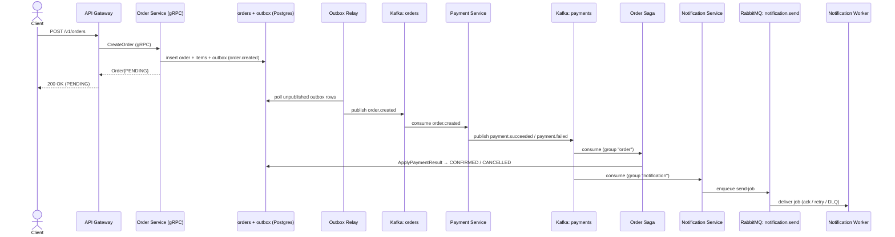

## What you built

ShopMicro is five Go services wired along two paths. The **synchronous** path is gRPC: the API Gateway [grpc-gateway →](/shopmicro/en/gateway/grpc-gateway/) translates REST/JSON into typed gRPC calls to [Catalog →](/shopmicro/en/catalog-service/) and [Order →](/shopmicro/en/order-service/), each owning its own PostgreSQL. The **asynchronous** path is events: Order publishes `order.created` to Kafka through the [outbox →](/shopmicro/en/order-service/outbox/) and its [relay →](/shopmicro/en/kafka/outbox-relay/), [Payment →](/shopmicro/en/payment-service/process-publish/) reacts and publishes `payment.*`, and two independent consumers read that result — the [saga →](/shopmicro/en/saga/orchestration/) moving each order to its terminal status, and [Notification →](/shopmicro/en/notification-service/consume-events/) enqueuing a RabbitMQ send-job that a [worker →](/shopmicro/en/notification-service/worker-deliver/) delivers. Around all of it, the [resilience →](/shopmicro/en/resilience/timeouts-retries/) layer makes every synchronous hop bounded, self-healing, and outage-aware.

Every piece of that sentence is something you now have working code for, and — more importantly — can explain *why* it's shaped the way it is.

## The request, end to end

A single `POST /v1/orders` sets the entire system in motion, with the client never waiting on any of it past the initial `PENDING` response:

The two consumers on the right — the saga and Notification — read the *same* `payments` topic under *different* groups, so each sees every payment result independently: one updates the order's state, the other tells the customer, and neither knows the other exists. That's the whole architecture in one picture.

## The decisions you can now defend

Every choice in this course was a trade-off, not a default. You can argue each one both ways:

| Decision | Why this way | The cost you accepted | Built in |
| --- | --- | --- | --- |
| Microservices over a monolith | Independent deploy/scale; clear ownership boundaries per domain | Network hops, partial failure, and operational overhead a monolith never has | [Architecture →](/shopmicro/en/introduction/architecture/) |
| gRPC for synchronous calls | Typed, fast, schema-first request/response between gateway and services | A hard runtime dependency: a callee being down is a caller's problem | [The gRPC Server →](/shopmicro/en/order-service/grpc-server/) |
| REST façade via grpc-gateway | One HTTP/JSON front door, generated from the same `.proto` — no drift | REST shape constrained to what `google.api.http` can express; an extra hop | [grpc-gateway →](/shopmicro/en/gateway/grpc-gateway/) |
| Kafka as a replayable event log | Many independent consumers, full history, replay for services added later | Every consumer must be idempotent under at-least-once redelivery | [Topics & Groups →](/shopmicro/en/kafka/topics-groups/) |
| RabbitMQ as a work queue | One job, one worker, per-message ack/retry/dead-letter; scale by adding workers | No replay — a job missed while a worker is down is gone unless it's still queued | [Exchanges & Queues →](/shopmicro/en/rabbitmq/exchanges-queues/) |
| Outbox pattern for publishing | The event and the state change commit in one transaction — never one without the other | A relay poll adds latency; events are published at-least-once, not exactly-once | [Outbox & Relay →](/shopmicro/en/kafka/outbox-relay/) |
| Choreography saga | No coordinator to build or depend on; adding a consumer costs existing services nothing | The end-to-end sequence isn't written down in any one place | [The Saga Handler →](/shopmicro/en/saga/orchestration/) |
| Idempotent consumers | `processed_events` + a terminal-state guard make at-least-once safe | Extra table and per-event bookkeeping on every consumer | [The Saga Handler →](/shopmicro/en/saga/orchestration/) |
| Resilience interceptors | Timeouts, retries, and a circuit breaker on every gRPC hop, invisible to business code | Global policy is blunt; behavior must be known, not read at the call site | [Timeouts & retries →](/shopmicro/en/resilience/timeouts-retries/) |
| Kubernetes + Helm | One repeatable, versioned deployment of the whole stack | Real cluster complexity you don't need for a single-node local run | [Kubernetes →](/shopmicro/en/kubernetes/) |

If you can state the second column *and* the third for each row, you understand this system — not just how it works, but why it was allowed to work this way.

## What was deliberately simplified

An honest course names what it left out. None of these are oversights; each was a scope decision that keeps a lesson about *one* thing:

- **No real payment gateway.** Payment decides from a `TotalCents` rule, not a card network. [Process & Publish →](/shopmicro/en/payment-service/process-publish/) was explicit that a real integration needs a persisted `payments` table and an idempotency key, because charging a card is a side effect the stateless design was never meant to make safe.
- **No authentication or authorization.** The gateway accepts every request. A real deployment puts identity in front — a topic [Where to go next →](/shopmicro/en/wrap-up/next-steps/) picks up.
- **No real notification provider.** The worker "delivers" by logging, and the recipient is a stub — the payment event carries an `order_id`, not a customer's email. Resolving contact details is left as an explicit simplification in [Consuming events →](/shopmicro/en/notification-service/consume-events/).
- **At-least-once, not exactly-once.** Both the Kafka and RabbitMQ hops can redeliver, which is why every consumer is idempotent rather than assuming a message arrives once.
- **No distributed compensation.** The saga moves an order to `CONFIRMED` or `CANCELLED`, but it doesn't unwind a multi-step process where a *later* step fails — a richer saga with real compensation is where an orchestrator starts to earn its cost.

## Recap

You built a real, event-driven microservice system: two gRPC services on Postgres behind a generated REST gateway, a Kafka event log and a RabbitMQ work queue used for exactly what each is good at, an event-driven Payment service, a choreography saga made safe with an outbox and idempotent consumers, a Notification service and worker bridging the two brokers, and a resilience layer that keeps the synchronous side bounded and self-healing — all packaged for Docker Compose and Kubernetes. More than the code, you can now defend every architectural decision as a trade-off and name exactly what the course simplified and why. Next, [Where to go next →](/shopmicro/en/wrap-up/next-steps/) turns those simplifications into a concrete roadmap for taking ShopMicro further.
