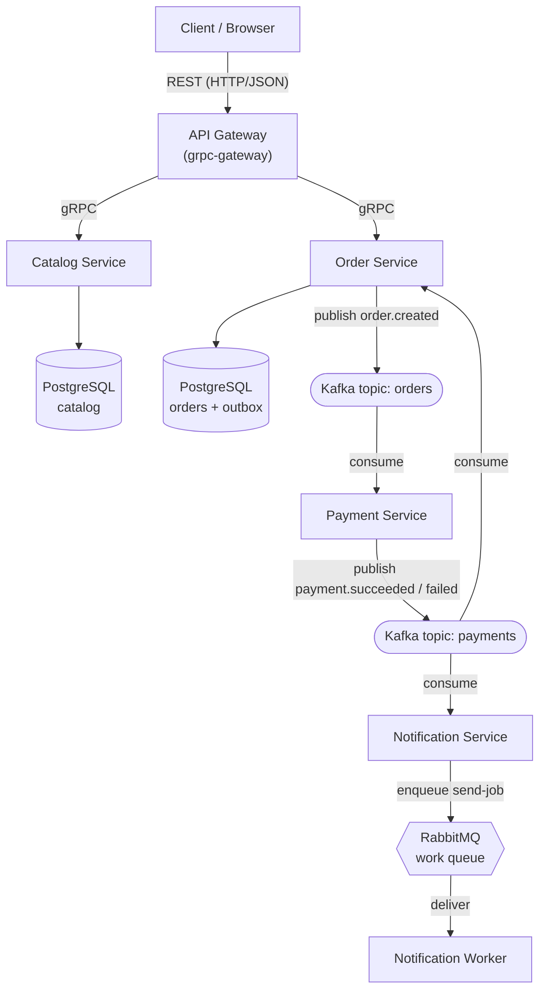
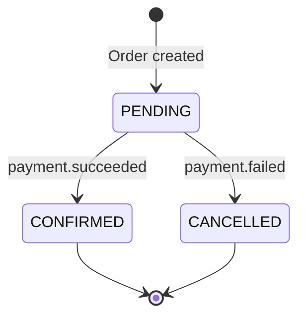
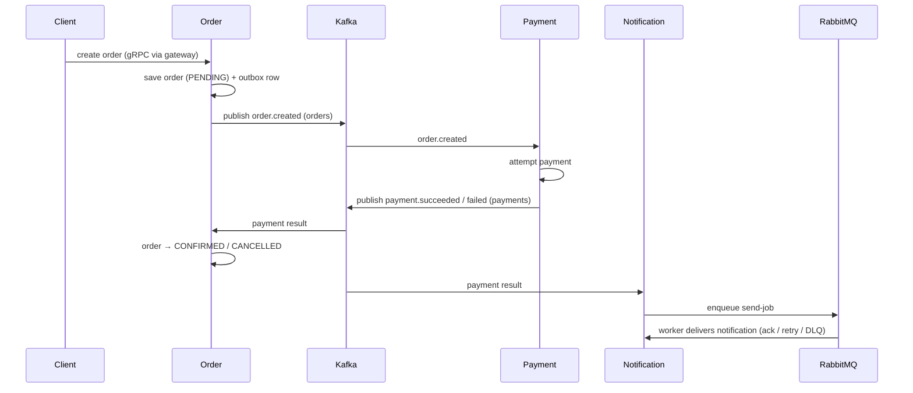

## สิ่งที่จะสร้าง

ก่อนจะเขียนโค้ดสักบรรทัด เรามาวาดภาพรวมทั้งระบบให้จบในหน้าเดียวกันก่อน ShopMicro มีเซอร์วิสห้าตัวและมีการสื่อสารระหว่างกันสองแบบ: **เส้นทาง synchronous** ที่ gateway เรียกเซอร์วิสแล้วรอคำตอบ (gRPC) และ **เส้นทาง asynchronous** ที่เซอร์วิส publish event แล้วเดินหน้าต่อ ปล่อยให้เซอร์วิสอื่นตอบสนองในจังหวะของตัวเอง (Kafka และ RabbitMQ)

ภาพรวมทั้งหมดหน้าตาแบบนี้:

**ลูกศร gRPC** ด้านบนคือเส้นทาง synchronous: request เข้ามาเป็น REST, gateway แปลงเป็น gRPC call, เซอร์วิสตอบกลับ แล้ว gateway แปลงคำตอบกลับเป็น JSON

**ลูกศร Kafka และ RabbitMQ** ด้านล่างคือเส้นทาง asynchronous: ไม่มีใครรอคำตอบ เซอร์วิสหย่อน event ลงบน log หรือ queue แล้วเซอร์วิสอื่นมาหยิบไปใช้เอง

## ทำไม

การแบ่งระบบแบบนี้ทำให้แต่ละส่วนได้ใช้เครื่องมือที่เหมาะกับงานนั้นที่สุด

gRPC ให้ request/response ที่รวดเร็วและมี type ระหว่าง gateway กับเซอร์วิสที่ต้องตอบ *เดี๋ยวนี้* (แสดงสินค้านี้, สร้าง order นี้) ส่วน Kafka ให้ **event log ที่คงทนและ replay ได้** สำหรับวงจรชีวิตของ order เพื่อให้ Payment และ Order ตอบสนองต่อ `order.created` และ `payment.*` ได้โดยไม่ต้องผูกติดกันแน่น และ RabbitMQ ให้ **work queue** สำหรับ side effect ของการส่ง notification จริง ๆ พร้อม ack และ retry เพื่อไม่ให้ความล้มเหลวชั่วคราวตอนส่งอีเมลทำ message หาย

### เส้นทาง synchronous (gRPC)

นี่คือ request/response แบบคลาสสิก — อ่านแคตตาล็อก, สั่งซื้อ:

1. **client** ส่ง HTTP/JSON request ไปยัง **API Gateway**
2. gateway (grpc-gateway) แปลงเป็น **gRPC** call แล้วส่งต่อไปยังเซอร์วิสที่ถูกต้อง — **Catalog** สำหรับสินค้า, **Order** สำหรับ order
3. เซอร์วิสรัน logic ของตัวเอง อ่านหรือเขียน **PostgreSQL ของตัวเอง** แล้วคืน gRPC response ที่มี type
4. gateway แปลง response กลับเป็น JSON แล้วตอบ client

ที่สำคัญคือ แต่ละเซอร์วิสเป็นเจ้าของฐานข้อมูลของตัวเอง Catalog เอื้อมไปแตะตารางของ Order ไม่ได้ ต้องถามผ่าน gRPC เท่านั้น การแยกกันแบบนี้แหละที่ทำให้แต่ละเซอร์วิส deploy อิสระได้

### เส้นทาง asynchronous (Kafka + RabbitMQ)

นี่คือสิ่งที่เปลี่ยน "สร้าง order" ให้กลายเป็น flow ที่ประสานงานข้ามหลายเซอร์วิส:

1. เมื่อสร้าง order เสร็จ Order จะ publish event **`order.created`** ไปยัง Kafka topic **`orders`** อย่างเชื่อถือได้ด้วย outbox pattern (มีรายละเอียดด้านล่าง)
2. **Payment** consume `order.created`, พยายามตัดเงิน แล้ว publish **`payment.succeeded`** หรือ **`payment.failed`** ไปยัง Kafka topic **`payments`**
3. **Order** consume topic `payments` แล้วเลื่อน order ไปเป็น `CONFIRMED` หรือ `CANCELLED`
4. **Notification** ก็ consume topic `payments` *เช่นกัน* แต่แทนที่จะส่งอีเมลตรงนั้นเลย จะ **enqueue send-job** ลงบน **RabbitMQ** work queue
5. **worker** ดึง job ออกจาก queue ส่ง notification แล้ว **ack** ถ้าส่งล้มเหลวก็ retry ใหม่ และถ้าล้มเหลวหลายครั้งเกินไป job จะไปตกที่ **dead-letter queue** ให้เราตามตรวจสอบ

ทำไมต้องมี broker สองตัว? Kafka คือ **event log** — เก็บ event ไว้และ **replay** ได้ หลายเซอร์วิส (ทั้ง Order *และ* Notification) จึงอ่าน stream `payments` เดียวกันได้อย่างอิสระ ส่วน RabbitMQ คือ **work queue** — send-job แต่ละอันควรมี worker เพียงตัวเดียวจัดการ พร้อม ack และ retry รายตัว บทเรียนที่แท้จริงคือการหยิบแต่ละตัวมาใช้ให้ตรงกับสิ่งที่ออกแบบมา

### order saga

flow นี้กินตั้งแต่ Order ไป Payment แล้วย้อนกลับมา Order เราจึงห่อไว้ใน database transaction เดียวไม่ได้ เพราะเซอร์วิสไม่ได้แชร์ฐานข้อมูลกัน ทางออกคือประสานงานเป็น **saga**: ลำดับของ local transaction ที่แต่ละอันมี event เป็นตัวจุดชนวน และเมื่อรวมกันก็ขับ order จาก `PENDING` ไปยังสถานะสุดท้าย

นี่คือ flow เดียวกันตามลำดับเวลา แสดงว่าใคร publish และ consume อะไร:

Order ใช้ **outbox pattern** เพื่อ publish `order.created` อย่าง **เชื่อถือได้** ใน database transaction *เดียวกัน* ที่บันทึก order Order จะเขียนแถว "outbox" ที่บรรยาย event นั้นลงไปด้วย จากนั้น publisher แยกต่างหากอ่านแถว outbox ที่ยังไม่ได้ส่ง push ไปยัง Kafka แล้วทำเครื่องหมายว่าส่งแล้ว

วิธีนี้รับประกันว่า event จะออกไป **ก็ต่อเมื่อ** บันทึก order สำเร็จเท่านั้น — ไม่มี event หาย ไม่มี event ผี และเพราะ consumer อาจเห็น event เดียวกันสองครั้ง (Kafka เป็น at-least-once) ทุก consumer จึงต้อง **idempotent**: ประมวลผล `order.created` หรือ `payment.succeeded` ตัวเดิมสองครั้งต้องได้ผลเหมือนประมวลผลครั้งเดียว

## ทำไมต้องเป็นสถาปัตยกรรมแบบนี้

การออกแบบของ ShopMicro คือชุดของการแลกเปลี่ยนที่ตั้งใจเลือก นี่คือมุมมองตรงไปตรงมาของแต่ละตัวเลือกหลัก

### Microservices (เทียบกับ monolith)

- **ข้อดี:** แต่ละเซอร์วิสเล็ก เป็นเจ้าของข้อมูลของตัวเอง และ deploy, scale หรือแม้แต่เขียนใหม่ได้อย่างอิสระ; ทีมหนึ่งเป็นเจ้าของเซอร์วิสหนึ่งได้ตั้งแต่ต้นจนจบ; การ crash ของ Payment ไม่ทำให้ Catalog ล้มตาม
- **ข้อเสีย:** คุณแลกการเรียกฟังก์ชันในโปรเซสเดียวกับการเรียกผ่านเครือข่ายที่ล้มเหลวได้ เพิ่ม latency และต้อง serialize; ไม่มี database transaction ก้อนเดียวข้ามเซอร์วิส; การดูแลเซอร์วิสห้าตัว + broker สองตัวมีชิ้นส่วนเคลื่อนไหวมากกว่า binary เดียวมาก
- **ทำไมเราถึงเลือก:** หัวใจของโปรเจกต์นี้คือการ *รู้สึก* ถึงการแลกเปลี่ยนเหล่านั้น สำหรับร้านเล็ก ๆ จริง ๆ monolith น่าจะง่ายกว่า — แต่คุณจะไม่มีวันได้เรียน gRPC, event streaming หรือ saga นั่นคือสิ่งที่ ShopMicro มาเพื่อสอนพอดี

### gRPC (เทียบกับ REST ระหว่างเซอร์วิส)

- **ข้อดี:** **contract ที่มี type** (protobuf) ที่ทั้งสองฝ่ายแชร์กัน ดักความไม่ตรงกันได้ตั้งแต่ตอน build; การส่งแบบ binary ที่กะทัดรัดบน HTTP/2 นั้นเร็ว; ได้ generated code ของ client และ server stub มาฟรี; streaming เป็น first-class
- **ข้อเสีย:** อ่านด้วยตาบน wire ไม่ได้เหมือน JSON; browser เรียกตรง ๆ ไม่ได้ (จึงต้องมี gateway); ต้องมี toolchain ของ `.proto` (buf) และ generated code อยู่ใน build
- **ทำไมเราถึงเลือก:** ระหว่างเซอร์วิสด้วยกัน contract ที่มี type เร็ว และ generate มาให้ ชนะ REST client ที่เขียนด้วยมือ ส่วนโลกภายนอกเรายังเปิด REST ให้ผ่าน grpc-gateway จึงได้ทั้งสองอย่าง

### Kafka เทียบกับ RabbitMQ — เมื่อไรใช้อะไร

สองตัวนี้ไม่ได้แข่งกัน แต่ทำงานคนละอย่าง และการรู้ว่าเมื่อไรควรหยิบตัวไหนคือทักษะหลัก

- **Kafka — event log** ใช้เมื่อ event เป็น **ข้อเท็จจริงเกี่ยวกับสิ่งที่เกิดขึ้น** ที่อาจมี **ผู้อ่านอิสระหลายราย** และอาจต้อง **replay** ทั้ง Order และ Notification ต่างอ่าน stream `payments` เดียวกัน และเซอร์วิสใหม่ที่เพิ่มเข้ามาทีหลังก็ยังอ่านประวัติทั้งหมดได้ เพราะ Kafka เก็บ event ไว้และให้แต่ละ consumer ติดตามตำแหน่งของตัวเอง
- **RabbitMQ — work queue** ใช้เมื่อ message เป็น **งานที่ต้องทำครั้งเดียว** โดย worker **หนึ่ง** ตัว พร้อม ack, retry และ dead-letter queue การส่ง notification เข้าเคสนี้เป๊ะ: enqueue งานเข้าไป worker หนึ่งตัวหยิบไปส่ง ack เมื่อสำเร็จ แล้ว retry หรือ dead-letter เมื่อล้มเหลว
- **การแลกเปลี่ยน:** Kafka เด่นเรื่อง fan-out และ replay แต่ต้องจัดการ offset และ partition ของ consumer เอง ส่วน RabbitMQ เด่นเรื่อง semantics ของงานรายตัว แต่ไม่ใช่ log ที่คงทนและ replay ได้ การเลือกผิดตัว (ใช้ work queue เป็น event log หรือกลับกัน) คือความผิดพลาดคลาสสิก ShopMicro จึงวางทั้งสองแบบไว้เคียงข้างกันให้เห็นชัด ๆ

### saga + outbox (เทียบกับ distributed transaction)

- **ข้อดี:** ไม่มี distributed lock หรือ two-phase commit ข้ามเซอร์วิส; แต่ละขั้นคือ local transaction ง่าย ๆ บวก event; outbox รับประกันว่า "บันทึกแล้วและ publish แล้ว" เป็น atomic; idempotent consumer ทำให้การส่งแบบ at-least-once ปลอดภัย
- **ข้อเสีย:** ชิ้นส่วนเคลื่อนไหวมากกว่า `BEGIN…COMMIT` เดียว; ระบบเป็นแบบ **eventually consistent** order จึงเป็น `PENDING` อยู่ครู่หนึ่งก่อนจะ `CONFIRMED`; logic ชดเชย (การยกเลิกเมื่อล้มเหลว) เป็นความรับผิดชอบของคุณ ไม่ใช่ของฐานข้อมูล
- **ทำไมเราถึงเลือก:** distributed transaction จริง (2PC) ข้ามเซอร์วิสอิสระนั้นเปราะบางและแทบไม่ถูกใช้ในทางปฏิบัติ saga คือวิธีที่ระบบ event-driven จริงรักษาความสอดคล้องของหลายเซอร์วิส และ outbox คือทริกมาตรฐานสำหรับ publish อย่างเชื่อถือได้

### Kubernetes + Helm (เทียบกับ Docker Compose)

- **ข้อดี:** Kubernetes ให้ self-healing, rolling deploy, scaling และ service discovery สำหรับระบบหลายเซอร์วิส; **Helm chart** แพ็กเซอร์วิสทั้งห้า + infrastructure ให้เป็นการติดตั้งเดียวที่มีเวอร์ชันและปรับพารามิเตอร์ได้
- **ข้อเสีย:** เส้นทางการเรียนรู้ชันกว่ามากและมี overhead ในการดูแลมากกว่า Compose; เกินความจำเป็นสำหรับเครื่องเดียว
- **ทำไมเราถึงเลือก:** Compose เหมาะกับ dev บนเครื่อง และเราใช้แบบนั้นพอดีใน Module 13 แต่ระบบ microservices *ออกแบบมา* ให้รันบน orchestrator Module 14 จึงแพ็ก ShopMicro เป็น Helm chart เพื่อให้เห็นว่า deploy จริงหน้าตาเป็นยังไง

## ตรวจสอบผล

ทดสอบความเข้าใจของคุณ:

- คุณไล่เส้นทางของ order ตั้งแต่ REST request ของ client ไปจนถึงสถานะ `CONFIRMED` และ notification ที่ถูกส่ง โดยเรียกชื่อทุก gRPC call และทุก event ได้ไหม?
- ทำไม order flow ถึงเป็น database transaction เดียวไม่ได้ และเราใช้อะไรมาแทน?
- คุณจะหยิบ Kafka เมื่อไร และหยิบ RabbitMQ เมื่อไร? บอกเหตุผลของแต่ละตัวใน ShopMicro
- outbox pattern รับประกันอะไร และทำไม consumer ถึงยังต้องเป็น idempotent?

## สรุป

ShopMicro คือเซอร์วิส Go ห้าตัวที่ต่อกันตามสองเส้นทาง **เส้นทาง synchronous** คือ gRPC: API Gateway แปลง REST เป็น gRPC call ที่มี type ไปยัง Catalog และ Order โดยแต่ละตัวเป็นเจ้าของ PostgreSQL ของตัวเอง

**เส้นทาง asynchronous** คือ event: Order publish `order.created` ไปยัง Kafka, Payment ตอบสนองแล้ว publish `payment.*` จากนั้นทั้ง Order และ Notification ก็ consume ต่อ — Order อัปเดตสถานะของ order ส่วน Notification enqueue RabbitMQ send-job ให้ worker

**saga** ประสานงาน `PENDING → CONFIRMED/CANCELLED` ข้ามเซอร์วิส **outbox** ทำให้การ publish เชื่อถือได้ และ **idempotent consumers** ทำให้การส่งแบบ at-least-once ปลอดภัย ทุกตัวเลือก — microservices, gRPC, Kafka เทียบ RabbitMQ, saga/outbox, Kubernetes/Helm — คือการแลกเปลี่ยนที่ตั้งใจเลือก และตอนนี้คุณอธิบายได้แล้ว ต่อไปเราจะไปตั้งค่าเครื่องของคุณใน [prerequisites](/shopmicro/th/introduction/prerequisites/)
