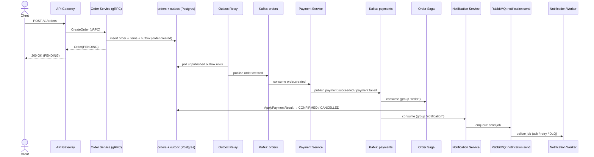

## What you built

ShopMicro คือห้าเซอร์วิส Go ที่ต่อสายไว้ตามสองเส้นทาง เส้นทาง **synchronous** คือ gRPC: API Gateway [grpc-gateway →](/shopmicro/th/gateway/grpc-gateway/) แปลง REST/JSON เป็น gRPC call แบบ typed ไปยัง [Catalog →](/shopmicro/th/catalog-service/) และ [Order →](/shopmicro/th/order-service/) ซึ่งแต่ละตัวเป็นเจ้าของ PostgreSQL ของตัวเอง เส้นทาง **asynchronous** คือ event: Order publish `order.created` ไป Kafka ผ่าน [outbox →](/shopmicro/th/order-service/outbox/) และ [relay →](/shopmicro/th/kafka/outbox-relay/) ของมัน, [Payment →](/shopmicro/th/payment-service/process-publish/) ตอบสนองแล้ว publish `payment.*` และ consumer อิสระสองตัวอ่านผลนั้น — [saga →](/shopmicro/th/saga/orchestration/) ย้ายแต่ละคำสั่งซื้อไปยัง status สุดท้าย และ [Notification →](/shopmicro/th/notification-service/consume-events/) enqueue RabbitMQ send-job ที่ [worker →](/shopmicro/th/notification-service/worker-deliver/) ส่ง รอบ ๆ ทั้งหมดนั้น layer [resilience →](/shopmicro/th/resilience/timeouts-retries/) ทำให้ทุก synchronous hop มีขอบเขต กู้ตัวเองได้ และรู้ทัน outage

ทุกส่วนของประโยคนั้นคือสิ่งที่คุณมีโค้ดที่ทำงานได้แล้ว และสำคัญกว่านั้นคือ อธิบายได้ *ว่าทำไม* มันถึงมีรูปร่างแบบนั้น

## The request, end to end

`POST /v1/orders` เดียวทำให้ทั้งระบบเคลื่อนไหว โดย client ไม่เคยรออะไรเลยหลังจาก response `PENDING` แรก:

consumer สองตัวทางขวา — saga กับ Notification — อ่าน topic `payments` *เดียวกัน* ภายใต้ group *ต่างกัน* ดังนั้นแต่ละตัวเห็นผลการชำระเงินทุกอันแบบเป็นอิสระ: ตัวหนึ่งอัปเดต state ของคำสั่งซื้อ อีกตัวแจ้งลูกค้า และไม่มีตัวไหนรู้ว่าอีกตัวมีอยู่ นั่นคือสถาปัตยกรรมทั้งหมดในภาพเดียว

## The decisions you can now defend

ทุกทางเลือกในคอร์สนี้เป็น trade-off ไม่ใช่ default คุณเถียงได้ทั้งสองทางในแต่ละอัน:

| Decision | ทำไมทางนี้ | ต้นทุนที่คุณยอมรับ | สร้างใน |
| --- | --- | --- | --- |
| Microservices แทน monolith | deploy/scale เป็นอิสระ; ขอบเขตความเป็นเจ้าของชัดต่อ domain | network hop, partial failure, และภาระ operation ที่ monolith ไม่มี | [Architecture →](/shopmicro/th/introduction/architecture/) |
| gRPC สำหรับ call แบบ synchronous | request/response แบบ typed, เร็ว, schema-first ระหว่าง gateway กับเซอร์วิส | dependency ตอน runtime แบบแข็ง: callee ที่ down เป็นปัญหาของ caller | [The gRPC Server →](/shopmicro/th/order-service/grpc-server/) |
| REST façade ผ่าน grpc-gateway | HTTP/JSON ประตูเดียว generate จาก `.proto` เดียวกัน — ไม่ drift | รูป REST ถูกจำกัดด้วยสิ่งที่ `google.api.http` แสดงได้; มี hop เพิ่ม | [grpc-gateway →](/shopmicro/th/gateway/grpc-gateway/) |
| Kafka เป็น event log ที่ replay ได้ | consumer อิสระหลายตัว, ประวัติเต็ม, replay ให้เซอร์วิสที่เพิ่มทีหลัง | consumer ทุกตัวต้อง idempotent ภายใต้ at-least-once redelivery | [Topics & Groups →](/shopmicro/th/kafka/topics-groups/) |
| RabbitMQ เป็น work queue | หนึ่ง job หนึ่ง worker, ack/retry/dead-letter ต่อ message; scale ด้วยการเพิ่ม worker | ไม่มี replay — job ที่พลาดตอน worker down หายไปนอกจากยังอยู่ใน queue | [Exchanges & Queues →](/shopmicro/th/rabbitmq/exchanges-queues/) |
| Outbox pattern สำหรับ publish | event กับการเปลี่ยน state commit ใน transaction เดียว — ไม่มีวันมีอันหนึ่งโดยไม่มีอีกอัน | relay poll เพิ่ม latency; event ถูก publish แบบ at-least-once ไม่ใช่ exactly-once | [Outbox & Relay →](/shopmicro/th/kafka/outbox-relay/) |
| Choreography saga | ไม่มี coordinator ให้สร้างหรือพึ่ง; การเพิ่ม consumer ไม่ทำให้เซอร์วิสเดิมเสียอะไร | ลำดับ end-to-end ไม่ได้เขียนไว้ที่ใดที่หนึ่ง | [The Saga Handler →](/shopmicro/th/saga/orchestration/) |
| Idempotent consumers | `processed_events` + terminal-state guard ทำให้ at-least-once ปลอดภัย | table เพิ่มและ bookkeeping ต่อ event บน consumer ทุกตัว | [The Saga Handler →](/shopmicro/th/saga/orchestration/) |
| Resilience interceptors | timeout, retry, และ circuit breaker บนทุก gRPC hop มองไม่เห็นจากโค้ด business | policy global blunt; behavior ต้องรู้ ไม่ใช่อ่านได้ที่ call site | [Timeouts & retries →](/shopmicro/th/resilience/timeouts-retries/) |
| Kubernetes + Helm | deployment ของทั้ง stack ที่ทำซ้ำได้และมี version เดียว | ความซับซ้อนของ cluster จริงที่ไม่ต้องมีสำหรับ local single-node | [Kubernetes →](/shopmicro/th/kubernetes/) |

ถ้าคุณบอกคอลัมน์ที่สอง *และ* ที่สามของแต่ละแถวได้ คุณเข้าใจระบบนี้แล้ว — ไม่ใช่แค่ว่ามันทำงานยังไง แต่ทำไมมันถึงถูกยอมให้ทำงานแบบนี้

## What was deliberately simplified

คอร์สที่ตรงไปตรงมาบอกสิ่งที่มันละไว้ ไม่มีอันไหนเป็นการมองข้าม แต่ละอันเป็นการตัดสินใจเรื่อง scope ที่ทำให้บทเรียนพูดถึง *เรื่องเดียว*:

- **ไม่มี payment gateway จริง** Payment ตัดสินจากกฎ `TotalCents` ไม่ใช่ card network [Process & Publish →](/shopmicro/th/payment-service/process-publish/) พูดชัดว่าการต่อจริงต้องมี `payments` table ที่ persist และ idempotency key เพราะการ charge card เป็น side effect ที่การออกแบบ stateless ไม่เคยตั้งใจทำให้ปลอดภัย
- **ไม่มี authentication หรือ authorization** gateway รับทุก request deployment จริงวาง identity ไว้ข้างหน้า — เรื่องที่ [Where to go next →](/shopmicro/th/wrap-up/next-steps/) หยิบต่อ
- **ไม่มี notification provider จริง** worker "ส่ง" ด้วยการ log และผู้รับเป็น stub — event ชำระเงินพก `order_id` ไม่ใช่อีเมลของลูกค้า การ resolve ข้อมูลติดต่อถูกละไว้อย่างตั้งใจใน [Consuming events →](/shopmicro/th/notification-service/consume-events/)
- **At-least-once ไม่ใช่ exactly-once** ทั้ง Kafka และ RabbitMQ hop redeliver ได้ นั่นคือเหตุผลที่ consumer ทุกตัว idempotent แทนที่จะสมมติว่า message มาถึงครั้งเดียว
- **ไม่มี distributed compensation** saga ย้ายคำสั่งซื้อไป `CONFIRMED` หรือ `CANCELLED` แต่ไม่ unwind กระบวนการหลายขั้นที่ขั้น *ทีหลัง* ล้มเหลว — saga ที่รวยกว่าพร้อม compensation จริงคือจุดที่ orchestrator เริ่มคุ้มค่า

## Recap

คุณสร้างระบบ microservice แบบ event-driven จริง: สอง gRPC service บน Postgres หลัง REST gateway ที่ generate มา, Kafka event log และ RabbitMQ work queue ที่ใช้เพื่อสิ่งที่แต่ละอันเก่ง, เซอร์วิส Payment แบบ event-driven, choreography saga ที่ทำให้ปลอดภัยด้วย outbox และ idempotent consumer, เซอร์วิส Notification และ worker ที่เชื่อมสอง broker, และ resilience layer ที่ทำให้ฝั่ง synchronous มีขอบเขตและกู้ตัวเองได้ — ทั้งหมด package สำหรับ Docker Compose และ Kubernetes มากกว่าโค้ด คุณ defend ทุกการตัดสินใจเชิงสถาปัตยกรรมเป็น trade-off ได้แล้ว และบอกได้เป๊ะว่าคอร์สทำอะไรให้ง่ายลงและทำไม บทถัดไป [Where to go next →](/shopmicro/th/wrap-up/next-steps/) เปลี่ยนการทำให้ง่ายเหล่านั้นเป็น roadmap ที่เป็นรูปธรรมสำหรับพา ShopMicro ไปต่อ
